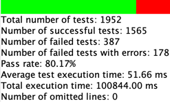
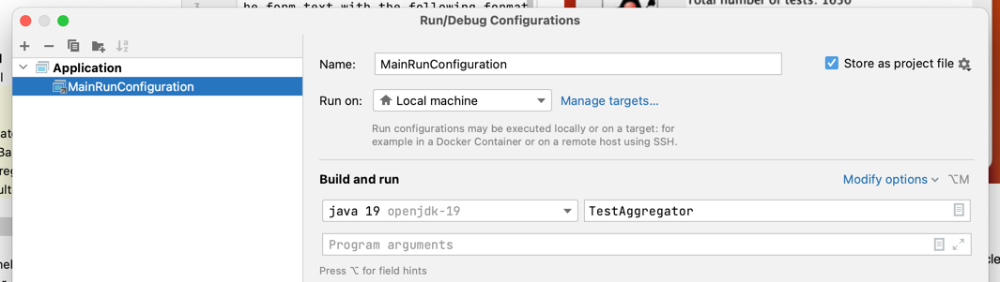
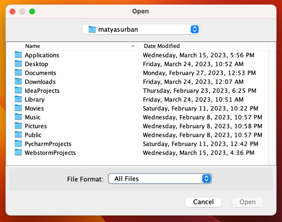
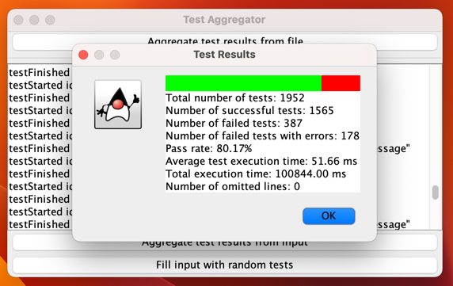

# Test Aggregator

The goal of this project is to take test results in the form text with the following format

`testStarted id="1" name = "test1"`

`testFinished id="1" duration="100" result=FAIL error="Error Message"`

And produce a report on the aggregated tests. Example report:

### Technical Aspects

This project was created using IntelliJ IDEA Ultimate (student), uses Oracle OpenJDK 19 and GUI is achieved using Swing.

### How to Run this Project

1. Download the repository and open the project in IntelliJ IDEA.
2. Make sure to have OpenJDK 19.
3. Configure run configuration (MainRunConfiguration should be included in the project).

4. Run the project.

5. To aggregate test results from file, click the button and select the file. If there are no problems with your file, you will see the aggregated test results.

6. Note that if you select a file that is not purely text (picture, pdf, ...), you will get an error.

7. Alternatively, you can paste your test results (for example from a console) into the text area (OR for demonstration click the button 'Fill input with random tests') and subsequently click 'Aggregate test results from input' button. You may resize the window to your liking.

